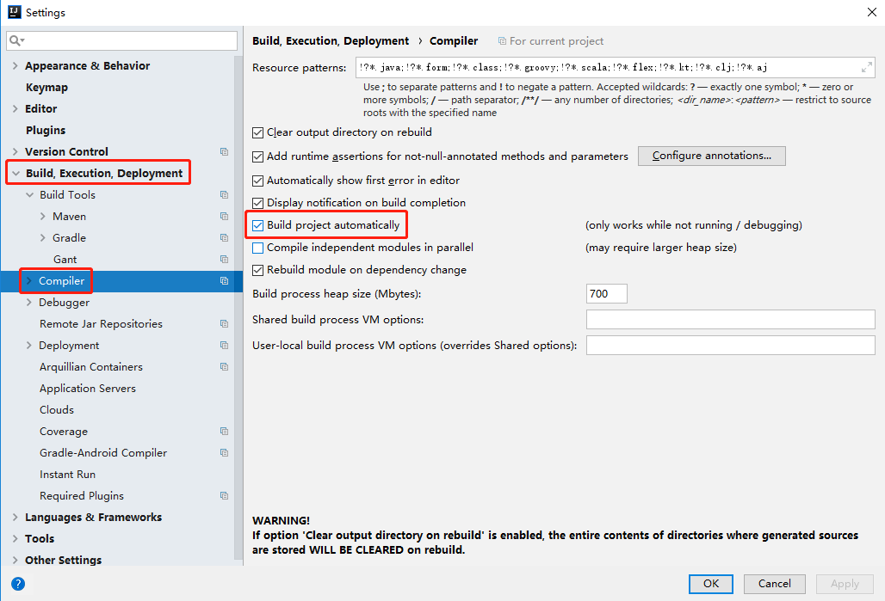
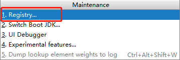
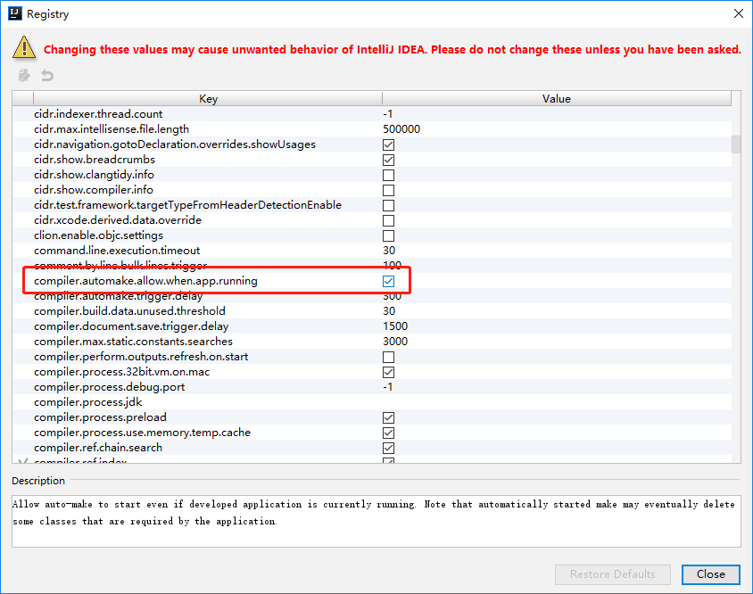

# springboot-devtools01

**springboot使用热部署**

## springboot使用热部署关键点
    1、在pom.xml文件中添加依赖
        <dependency>
            <groupId>org.springframework.boot</groupId>
            <artifactId>spring-boot-devtools</artifactId>
            <optional>true</optional>
        </dependency>
    2、开启IDEA对热部署的支持
        (1)、Settings --> Build，Execution，Deployment --> 勾选Build project automatically
        
        (2)、按快捷键Ctrl + Shift + Alt + /，选择Registry，勾选compiler.automake.allow.when.app.running
        
        