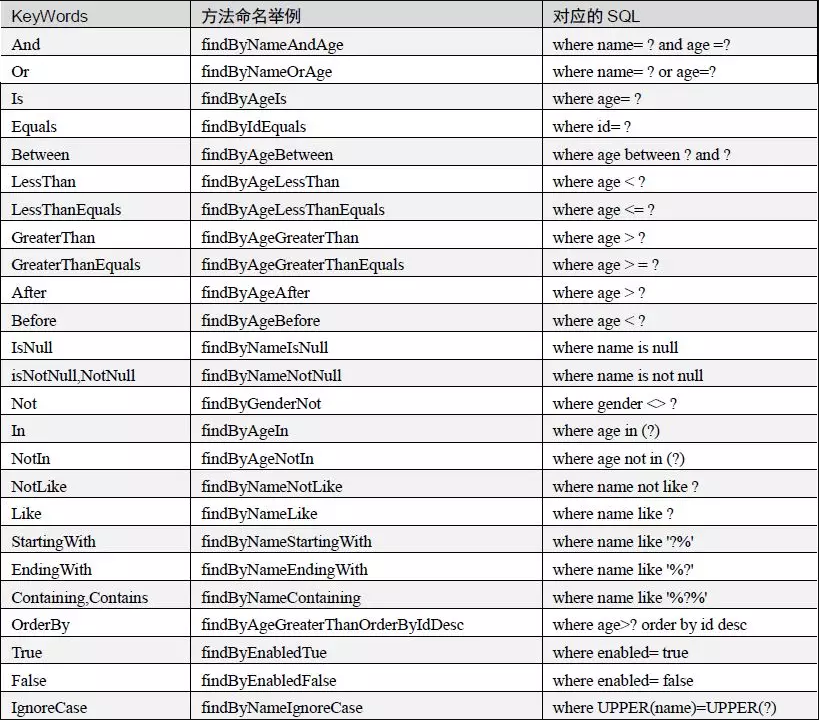

# springboot-springdatajpa02

**springboot整合springdatajpa实现增删改查**

## springboot整合springdatajpa关键点
    1、在pom.xml文件中添加依赖
        <!-- redis -->
        <dependency>
             <groupId>org.springframework.boot</groupId>
             <artifactId>spring-boot-starter-data-jpa</artifactId>
        </dependency>

    2、在application.properties文件中配置jpa配置
        # datasource
        spring.datasource.url=jdbc:mysql://188.131.247.26:3306/springboot-springdatajpa01?serverTimezone=UTC&useUnicode=true&characterEncoding=utf-8&useSSL=true
        spring.datasource.driver-class-name=com.mysql.jdbc.Driver
        spring.datasource.username=root
        spring.datasource.password=root
        # springdatajpa
        #打印出自动生产的SQL，方便调试的时候查看
        spring.jpa.show-sql=true
        #更新数据库表结构
        spring.jpa.hibernate.ddl-auto=update
        #对打印的sql进行格式化，方便查看
        spring.jpa.properties.hibernate.format_sql=true
        spring.jpa.properties.hibernate.use_sql_comments ＝ true
        #指定生成表名的存储引擎为InneoDB
        spring.jpa.properties.hibernate.dialect=org.hibernate.dialect.MySQL5InnoDBDialect
        
    3、自定义接口继承JpaRepository<User, Long>接口
        自定义查询方法，关键词可以是：
        